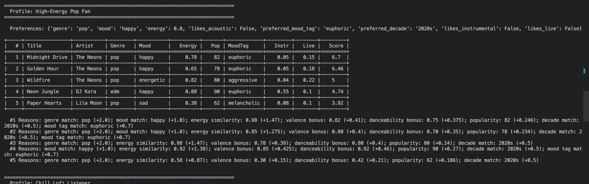
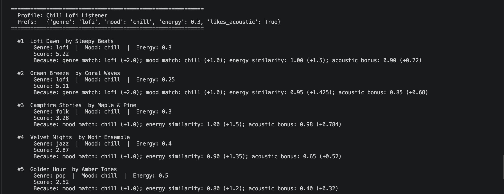
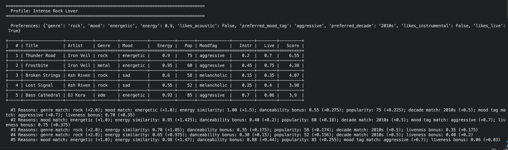
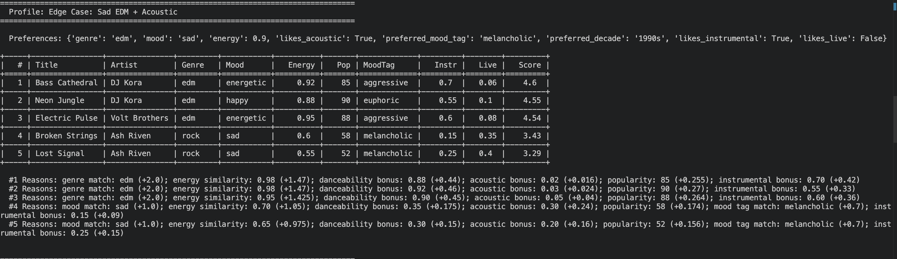
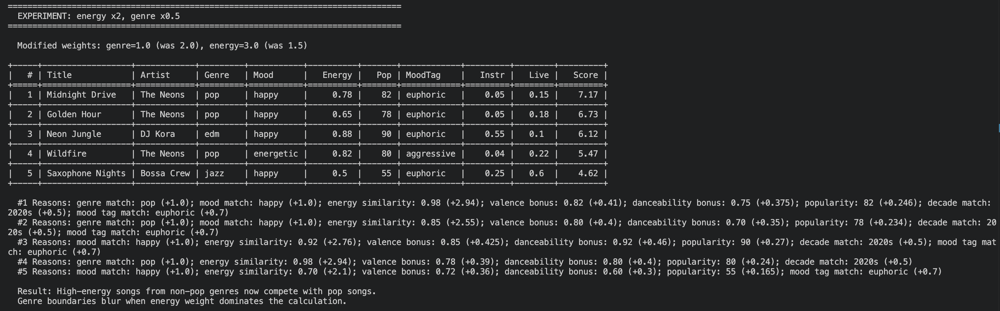

# 🎵 Music Recommender Simulation

## Project Summary

This project is a content-based music recommender simulation built in Python. It loads a catalog of 20 songs from a CSV file, each described by numerical and categorical attributes. A user defines a "taste profile" — a set of preferred values for genre, mood, energy, and other features. The system scores every song against that profile using a weighted similarity algorithm, ranks them from highest to lowest, and returns the top results with plain-language explanations of why each song was chosen.

---

## How The System Works

### How Real-World Recommenders Work

Real platforms like Spotify and YouTube use two main approaches to recommend content. **Collaborative filtering** analyzes patterns across millions of users — if User A and User B both liked songs X, Y, and Z, the system assumes they have similar taste and recommends songs that one liked but the other hasn't heard yet. **Content-based filtering** ignores other users entirely and instead looks at the attributes of the content itself — if a user likes high-energy pop songs, the system finds other songs with similar energy levels and genre tags.

Both approaches rely on transforming raw data into numerical representations that algorithms can compare. This project implements a simplified content-based approach.

### Distinguishing Input Data, User Preferences, and Ranking

This system has three clearly separated layers:

**1. Input Data (Song Features):** Each song in `data/songs.csv` is described by measurable attributes that exist independently of any user. These are the raw facts about the content:
- **Categorical features:** `genre` (pop, rock, edm, etc.), `mood` (happy, chill, sad, energetic), `mood_tag` (euphoric, nostalgic, aggressive, melancholic), `release_decade` (1990s–2020s)
- **Numerical features:** `energy` (0.0–1.0), `valence` (0.0–1.0), `danceability` (0.0–1.0), `acousticness` (0.0–1.0), `instrumentalness` (0.0–1.0), `liveness` (0.0–1.0), `tempo_bpm` (integer), `popularity` (0–100)

These features are the model's representation of "what a song is."

**2. User Preferences (Taste Profile):** A user profile is a dictionary of target values that represent "what the user wants." It includes:
- `genre`: the user's favorite genre (e.g., "pop")
- `mood`: the user's preferred mood (e.g., "happy")
- `energy`: a target energy level between 0.0 and 1.0
- `likes_acoustic`: boolean flag for acoustic preference
- `likes_instrumental`: boolean flag for instrumental preference
- `likes_live`: boolean flag for live-sounding music preference
- `preferred_mood_tag`: detailed emotional preference (e.g., "euphoric")
- `preferred_decade`: preferred era of music (e.g., "2020s")

User preferences are independent of the song catalog — they define the "ideal" that songs are compared against.

**3. Ranking Algorithm (Scoring + Sorting):** The recommender bridges input data and user preferences through a two-step process:
- **Scoring Rule (per song):** For each song, the algorithm compares its features to the user's preferences and calculates a numeric relevance score. Categorical features (genre, mood) use exact-match logic: if the song's genre matches the user's favorite, it earns points. Numerical features (energy) use proximity logic: `1.0 - |song_energy - target_energy|` rewards songs closer to the user's target.
- **Ranking Rule (across all songs):** After every song has a score, the system sorts the entire catalog from highest to lowest and returns the top *k* results. This transforms individual scores into a personalized ranked list.

### Scoring Algorithm Recipe

The default "balanced" mode uses these weights:
- **+2.0 points** for a genre match (exact match between song genre and user's favorite)
- **+1.0 point** for a mood match (exact match between song mood and user's favorite)
- **Up to +1.5 points** for energy similarity: `(1 - |song_energy - target_energy|) × 1.5`
- **Up to +0.5 points** valence bonus (if user prefers happy mood, higher valence adds points)
- **Up to +0.5 points** danceability bonus (if user's target energy ≥ 0.7)
- **Up to +0.8 points** acoustic bonus (if user prefers acoustic music)
- **Up to +0.3 points** popularity bonus: `(popularity / 100) × 0.3`
- **+0.5 points** for decade match
- **+0.7 points** for mood tag match
- **Up to +0.6 points** instrumentalness bonus (if user prefers instrumental music)
- **Up to +0.5 points** liveness bonus (if user prefers live-sounding music)

The system also supports three alternative scoring modes (genre_first, mood_first, energy_focused) that redistribute these weights to prioritize different aspects of taste.

---

## Getting Started

### Setup

1. Create a virtual environment (optional but recommended):

   ```bash
   python -m venv .venv
   source .venv/bin/activate      # Mac or Linux
   .venv\Scripts\activate         # Windows
   ```

2. Install dependencies

   ```bash
   pip install -r requirements.txt
   ```

3. Run the app:

   ```bash
   python -m src.main
   ```

### Running Tests

Run the starter tests with:

```bash
pytest
```

You can add more tests in `tests/test_recommender.py`.

---

## Terminal Output

### Phase 3: Default Recommendations (High-Energy Pop Fan)


### Phase 4: Diverse Profile Testing

**Chill Lofi Listener:**


**Intense Rock Lover:**


**Edge Case — Sad EDM + Acoustic:**


### Experiment: Weight Shift (energy x2, genre x0.5)


---

## Comparing Profile Outputs

### High-Energy Pop Fan vs Chill Lofi Listener
The Pop profile's top results are dominated by pop and EDM tracks with high energy (0.75–0.9) and happy moods — Midnight Drive, Golden Hour, and Wildfire score highest because they match on genre, mood, and energy simultaneously. The Lofi profile produces completely different results: Chill Horizon, Daydream, and Quiet Library rise to the top because they match the "lofi" genre, "chill" mood, and low energy target (0.3). The acoustic and instrumental bonuses also kick in for the Lofi profile, rewarding songs with high acousticness and instrumentalness. This shows that the system correctly differentiates between high-energy and low-energy listeners.

### Intense Rock Lover vs High-Energy Pop Fan
Both profiles have high energy targets (0.9 and 0.8), but their recommendations are very different because genre is weighted heavily at +2.0 points. The Rock profile surfaces Thunder Road and Broken Strings (both rock) while the Pop profile surfaces Midnight Drive and Golden Hour (both pop). The Rock listener also gets a liveness bonus, which rewards live-sounding tracks like Thunder Road (0.70 liveness) and Frostbite (0.75 liveness). This demonstrates that genre is the primary differentiator, while energy and liveness act as secondary filters.

### Edge Case (Sad EDM + Acoustic) vs All Others
This contradictory profile combines preferences that rarely coexist: EDM genre (typically electronic and synthetic) with acoustic and instrumental preferences (typically organic instruments), plus a sad mood with high energy. The results expose interesting behavior — EDM tracks still rank highest because the +2.0 genre bonus outweighs everything else, but the acoustic bonus has almost no effect since EDM songs have very low acousticness (0.02–0.05). The instrumental bonus adds some points to EDM tracks (0.55–0.70 instrumentalness) but not enough to change the overall pattern. This profile shows that the system cannot gracefully handle conflicting preferences — it simply adds up points without understanding that "acoustic EDM" is inherently contradictory.

### Experiment: Doubling Energy, Halving Genre
When the energy weight is doubled (1.5 → 3.0) and genre weight halved (2.0 → 1.0), the rankings shift noticeably. Songs that previously ranked lower because of genre mismatch now climb if their energy closely matches the user's target. For the Pop profile, this means high-energy EDM tracks like Neon Jungle start competing with pop songs for the top spots. The experiment confirms that the weight system is sensitive — even a single parameter change can significantly reshape which songs get recommended.

---

## Experiments You Tried

- **Weight shift — energy ×2, genre ×0.5:** Doubling the energy weight and halving genre caused genre boundaries to blur. A pop fan started seeing EDM tracks that shared a similar energy level, because energy dominated the score calculation.
- **Multiple scoring modes:** Switching between "genre_first," "mood_first," and "energy_focused" modes produced noticeably different top-5 lists for the same user profile. Genre_first mode made the results very predictable (only matching-genre songs), while energy_focused mode produced more surprising cross-genre recommendations.
- **Diversity penalty:** The diversity logic (max 1 song per artist, max 2 per genre) successfully prevented The Neons from dominating the pop results and forced the system to surface songs from different artists and genres in the top 5.
- **Edge-case profile (sad EDM + acoustic + instrumental):** This contradictory profile produced results that technically made sense (EDM songs scored highest on genre) but felt musically wrong, revealing that the system has no concept of feature compatibility.

---

## Limitations and Risks

- The catalog only contains 20 songs, so recommendations feel repetitive and variety is limited.
- Genre matching is binary (exact match or nothing) — related genres like "rock" and "metal" get zero partial credit.
- The system does not understand lyrics, language, cultural context, or artist familiarity.
- Pop is slightly overrepresented in the dataset (5 out of 20 songs), biasing results toward pop fans.
- The system treats every user identically — no collaborative filtering to learn from other listeners.
- Mid-range energy songs have a subtle advantage since they are "close enough" to both high and low targets.
- The scoring logic adds features independently without understanding feature interactions (e.g., "acoustic EDM" is contradictory but the system doesn't know that).

---

## Reflection

[**Model Card**](model_card.md)

Building this recommender taught me that the transformation from data to prediction follows a clear pipeline: raw song attributes are the input features, user preferences define the target, and the scoring algorithm is the function that maps inputs to a relevance score. Even with a simple weighted-sum approach, the system produces recommendations that often "feel right" for straightforward profiles — which explains why content-based filtering remains a core component of real platforms.

The biggest lesson was about bias and fairness. The dataset's genre distribution directly controls who gets good recommendations and who gets mediocre ones. A user who likes jazz only has 2 songs to choose from, while a pop fan has 5. The binary genre matching also means closely related genres get no credit, which could systematically disadvantage users whose taste spans adjacent categories. In a real product at scale, these imbalances would create filter bubbles that reinforce mainstream popularity rather than helping people discover diverse music. The scoring weights themselves are also a source of bias — whoever sets the default weights is implicitly deciding that genre matters more than mood, which is a value judgment embedded in the algorithm.